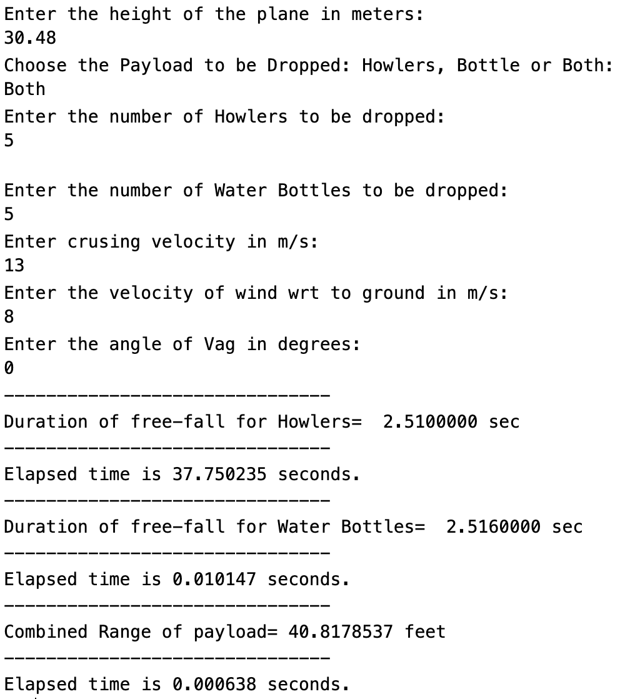
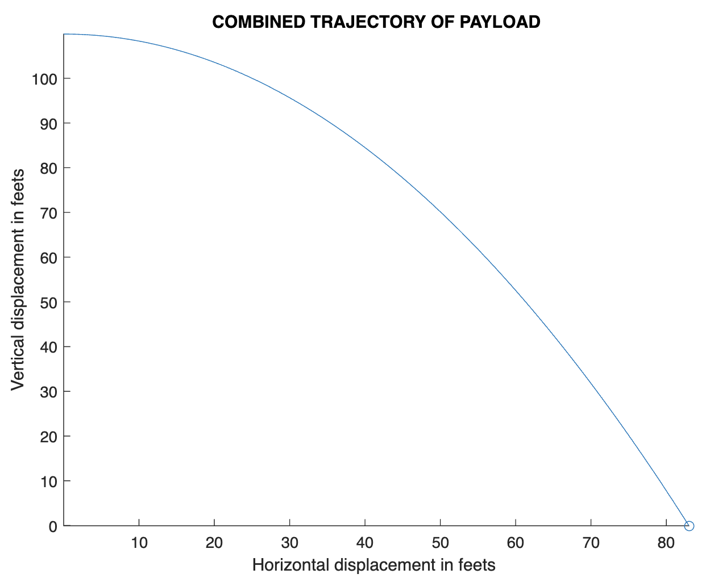

# Autonomous-Payload-Drop

Matlab based Trajectory Simulation of the Actual Code that will run on Data Acqusition System onboard the Primary Aircraft.

* Drag values for Howlers and Water Bottles (Supply Payloads) were computed using Computational Fluid Dynamics.

* Drag Coefficients (Cd) for the respective payloads were calcualted using Drag Equation.
* Calculated values along with Airspeed, Average Wind Speed (in Lakeland, Florida) were added to the matlab code.

#### Matlab Terminal

Reference:

Neelay Doshi (2020). Trajectory of a Dropped Payload (https://www.mathworks.com/matlabcentral/fileexchange/61107-trajectory-of-a-dropped-payload), MATLAB Central File Exchange. Retrieved December 29, 2020.
